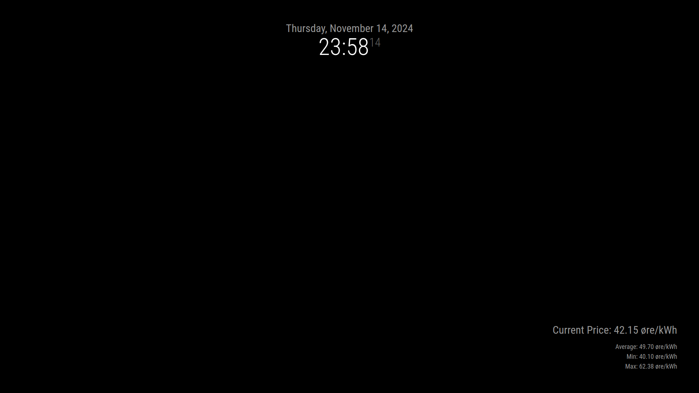

# MMM-NorwayPower

A [MagicMirror²](https://github.com/MichMich/MagicMirror) module that displays Norwegian electricity prices from [hvakosterstrommen.no](https://www.hvakosterstrommen.no/).

## Features
- Displays current electricity price
- Shows today's average, lowest, and highest prices
- Visual graph of price variations throughout the day
- Color indicators for price levels (green for low, yellow for medium, red for high)
- Supports both English and Norwegian languages
- Automatic updates every hour

## Installation

```bash
cd ~/MagicMirror/modules
git clone https://github.com/trymthoren/MMM-NorwayPower.git
cd MMM-NorwayPower
npm install
```

## Configuration

Add this to your config/config.js file:

```javascript
{
    module: 'MMM-NorwayPower',
    position: 'bottom_right',  // Any region of your choice
    config: {
        region: "NO1",         // Your price region
        showGraph: true,       // Show price graph
        showAverage: true,     // Show average price
        showHighLow: true,     // Show highest and lowest price
        language: "en"         // 'en' for English, 'nb' for Norwegian
    }
}
```
### Configuration Options

| Option           | Description                   | Default Value |
|-----------------|-------------------------------|---------------|
| `region`        | Price region (NO1-NO5)*       | `"NO1"`      |
| `showGraph`     | Display price graph           | `true`       |
| `showAverage`   | Show average price            | `true`       |
| `showHighLow`   | Show high/low prices          | `true`       |
| `updateInterval`| Update frequency (ms)         | `3600000`    |
| `language`      | Display language (en/nb)      | `"en"`       |
| `priceUnit`     | Price unit display            | `"øre/kWh"`  |
| `coloredText`   | Use colored price indicators  | `true`       |

*Price Regions:

NO1: Oslo / Øst-Norge
NO2: Kristiansand / Sør-Norge
NO3: Trondheim / Midt-Norge
NO4: Tromsø / Nord-Norge
NO5: Bergen / Vest-Norge

## Updates
To update the module to the latest version:

```bash
cd ~/MagicMirror/modules/MMM-NorwayPower
git pull
npm install
```




## Contributing
Feel free to contribute to this module by:

Forking the repository
Creating a feature branch
Making your changes
Creating a pull request

Attribution
This module uses data from hvakosterstrommen.no, a free and open electricity price API for Norway.

## License

MIT License - See LICENSE file for details

